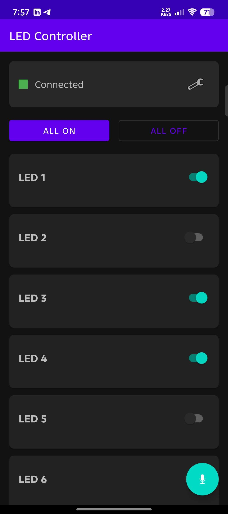
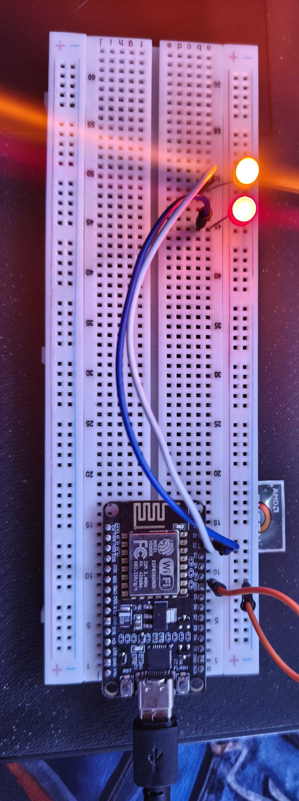
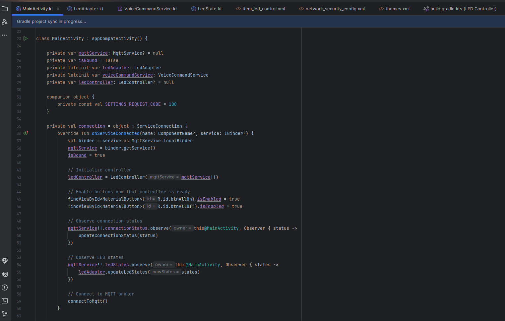

# 🏠 Wireless Smart Home Using Wi-Fi

## Overview
This project is a high-performance, Wi-Fi-based Smart Home system designed to allow users to securely monitor and control home appliances in real time. It features a custom Android application built with Kotlin and firmware deployed on an ESP8266 microcontroller, utilizing optimized network protocols for low-latency IoT communication.

## ⚙️ System Architecture
The system employs a decoupled, secure IoT architecture to ensure reliable data transmission and command execution:

1. **Client Layer (Android App):** Native Android application built with Kotlin, serving as the user dashboard to trigger commands, parse data, and display real-time appliance statuses.
2. **Broker Layer (MQTT):** Acts as the central messaging hub, managing pub/sub topics efficiently to handle light payloads with low overhead.
3. **Hardware Control Layer (ESP8266):** Microcontroller firmware that connects via local Wi-Fi, processes incoming payloads to trigger hardware relays, and publishes telemetry updates.
4. **Security Layer:** Implementation of TLS/SSL encryption over MQTT to prevent unauthorized access and secure all control commands.

## 🚀 Key Features
- **Real-Time Remote Control:** Instant, low-latency control and live monitoring of home appliances.
- **Secure Networking:** End-to-end encryption using TLS/SSL to safeguard device-to-cloud communication.
- **Robust Connection Handling:** Embedded network resilience algorithms for automatic reconnection in case of Wi-Fi or broker drops.
- **OTA Updates:** Support for secure Over-The-Air firmware updates for seamless hardware maintenance.

## 🛠️ Technologies & Protocols
- **Hardware:** ESP8266, Relays & Sensors
- **Firmware Development:** Arduino IDE, C/C++
- **Mobile Development:** Android Studio, Kotlin
- **Network Protocol:** MQTT (Publish/Subscribe)
- **Data Format:** JSON for lightweight, structured payloads
- **Security:** TLS/SSL Encryption, Wi-Fi Security (WPA2)

## 📸 Project Documentation & Media

### 🖥️ User Interface & Hardware Setup
| Android App Dashboard | Hardware Implementation |
|:---:|:---:|
|  |  | 
## ⚙️ Architecture & Backend Logs

| Clean Code Architecture (Kotlin) | Real-Time MQTT Payload Logs |
|:---:|:---:|
|  |  |
## 🔒 Source Code Notice
The source code for both the Android application and the ESP8266 firmware is **private** and is not included in this repository. 

This repository serves as a portfolio showcase documenting the project's conceptual design, network architecture, technical specifications, and overall implementation.

## 👤 Author

**Zain Al-Abdeen Salim Malik**  
Computer Science | Network Specialist & Web Developer  
*University of Technology – Iraq*

